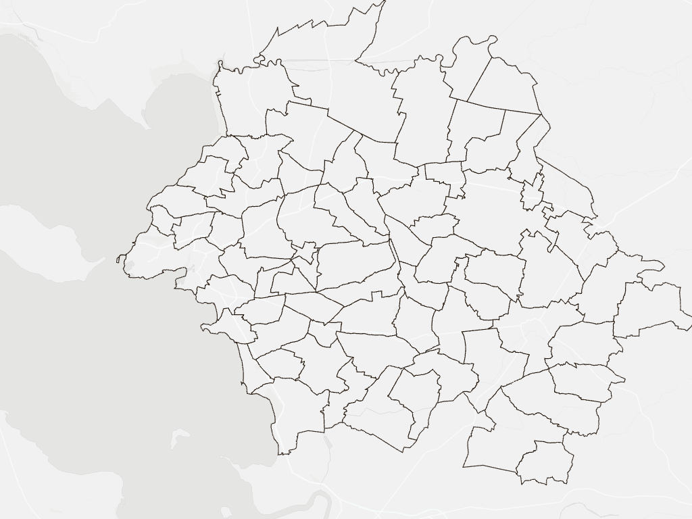
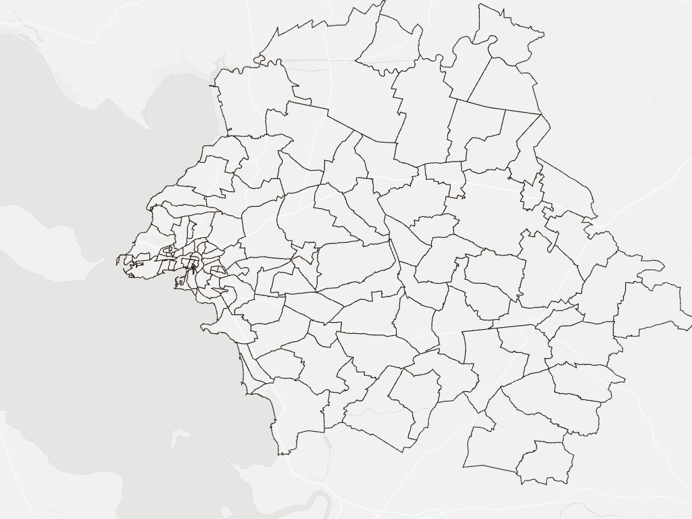
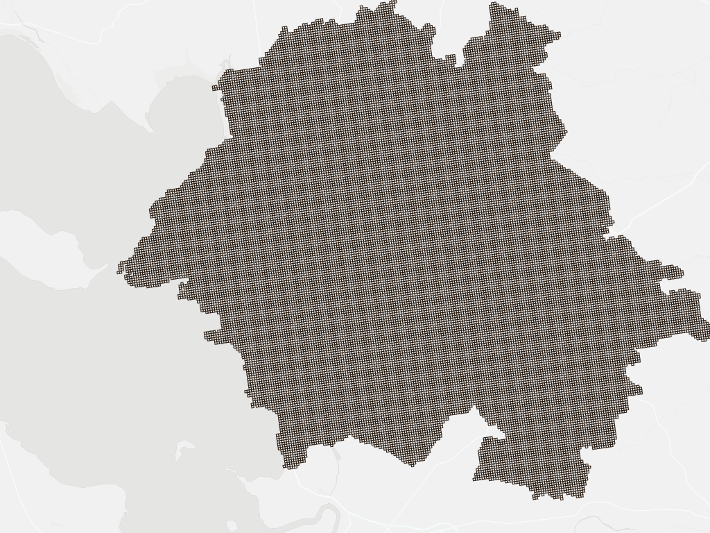

# La Rochelle commuting data

Open data on home-to-work commuting, real estate, energy, population, income, employment, and amenities for the La Rochelle area (Charente-Maritime, plus 2 communes in Vendée), at three levels of geographic detail.

```
.
├── geo-data/       map boundaries only (join key + geometry)
├── mobility/       travel times & distances (car, bike, walk, transit) + professional km driven
├── population/     population by age, occupation, nationality
├── income/         median income, poverty rate, inequality
├── employment/     number of jobs by workplace location, sector, category
├── real-estate/    residential transaction prices
├── energy/         electricity & gas consumption, housing energy quality
├── amenities/      schools, shops, healthcare, transit stops (point layer)
├── transit/        real bus & train routes and stops (GTFS)
└── README.md
```

## Three levels of detail & geo layers

The data covers the La Rochelle commuting area at three sizes of area — same geography, different zoom level:

- **c200** — 200m×200m INSPIRE grid squares, identified by `idINS`. Most detail.
- **IRIS** — INSEE's neighborhood-level statistical zones, identified by `IRIS` (code_iris). Medium detail.
- **communes** — municipalities, identified by `COMMUNE` (INSEE code géographique). Least detail.

Grid squares roll up into IRIS zones, which roll up into communes.

| Communes — 73 zones | IRIS — 116 zones | 200m grid — 32,700 cells |
|---|---|---|
|  |  |  |

Same area, same zoom level in each image — only the boundaries change. Communes are the fewest, largest shapes; IRIS splits each urban commune into several neighborhood-sized zones (visible as the dense cluster of small polygons around La Rochelle city center); the 200m grid is fine enough that at this zoom it renders as a solid texture rather than individual squares — that's the resolution `c200` data operates at.

Each level's map shape lives in [`geo-data/`](geo-data/) — geometry and join key only, no data values:

- [`geo-data/larochelle_c200_boundary.geojson`](geo-data/larochelle_c200_boundary.geojson) (also has `has_data`, since it covers every grid square, not just the ones with data)
- [`geo-data/larochelle_iris_boundary.geojson`](geo-data/larochelle_iris_boundary.geojson)
- [`geo-data/larochelle_communes_boundary.geojson`](geo-data/larochelle_communes_boundary.geojson)

Every data file below (in [`mobility/`](mobility/), [`population/`](population/), [`income/`](income/), [`employment/`](employment/), [`real-estate/`](real-estate/), and [`energy/`](energy/)) is a plain CSV that joins onto the matching boundary file on that shared key. In QGIS: Layer → Properties → Joins (add the CSV, match the field on each side). [`geo-data/communes_names_points.csv`](geo-data/communes_names_points.csv) maps each `COMMUNE` code to its town name, plus a `longitude`/`latitude` reference point (each commune's official center point, from the French government's geo API) if you want readable labels or a quick point-on-map without loading the full boundary file — e.g. a symbol map sized by another column joined in from elsewhere.

[`amenities/`](amenities/) and [`transit/`](transit/) are the exception — their points/lines already carry their own coordinates, so there's nothing to join. See the Amenities section below for how to aggregate `amenities/` to a level instead.

## Mobility ([`mobility/`](mobility/))

Home-to-work travel times and distances. All three levels use the exact same columns, weighted by population times jobs for each travel between a pair of individual and job:

- **distance** — weighted average road distance from home to work place, in meters
- **tt_car / tt_bike / tt_walk / tt_transit** — average weighted travel time in minutes between home and work place, by car, bike, walk, and transit
- **part_transit** — the share (0.5 means 50%) of the population who has access to the transit system; `tt_transit` is calculated for this population only
- **walktime** — average weighted travel time in minutes between home and the entry station in the transit system (bus, metro, train, ...)

Files: `larochelle_c200_mobility.csv` (5,455 rows) · `larochelle_iris_mobility.csv` (116 rows) · `larochelle_communes_mobility.csv` (73 rows). [`mobility/source/`](mobility/source/) has `codebook.txt` (the original column definitions) and `data.R` (the script that originally built these from raw distance/employment data).

**Professional km driven** — a second set of files, one column each: `larochelle_c200_kmpro.csv`, `larochelle_iris_kmpro.csv`, `larochelle_communes_kmpro.csv`.

- `km_pa` — kilometers driven by car per year, per working person, for commuting.
- `f_i`, `ind_18_64` (c200 file only) — number of working (active) people and number of working-age people in the grid cell; the c200 file also repeats `IRIS`/`COMMUNE` for convenience so it can be joined at any level without a separate lookup.

**A caveat worth knowing before mapping `tt_transit`:** it's only averaged over the population the model considers to have any transit access at all (`part_transit`). In most of the 72 communes `part_transit` is under 1% — meaning `tt_transit` there reflects a near-empty sample, not a typical commute, and shouldn't be compared directly to `tt_car`. `part_transit` is genuinely bimodal across the area (42 communes under 2%, 30 communes from 33–58%, almost nothing in between) — a sensible cutoff around 0.1 cleanly separates "real signal" from "noise" if you're shading a map by transit reliability.

## Public transportation routes & stops ([`transit/`](transit/))

The actual bus, boat, and train infrastructure behind the `mobility/` transit-time columns above — real GTFS routes and stops, not modeled travel times. Three networks: Yélo (the La Rochelle agglomeration's own urban network — 122 routes, 536 stops, including night/Sunday/school-shuttle lines and 2 harbor boat shuttles), the Charente-Maritime interurban coach network (the rural periphery Yélo doesn't reach), and the SNCF train lines through La Rochelle. See [`transit/README.md`](transit/README.md) for full sourcing and what's simplified (representative route shapes kept from multiple variants, straight-line train routes since SNCF's feed has no track geometry).

## Population ([`population/`](population/))

Population figures at each level come from a different INSEE source, so the columns aren't identical level to level — each is listed separately. Full sourcing and data-quality caveats (small-cell imputation, rounding, etc.) are in [`population/README.md`](population/README.md).

**`larochelle_communes_population.csv`** (72 rows) — current legal population + a past-census time series:
- `population_1990` … `population_2020` — past census counts; `population_2026` — the current official legal population (not a projection — INSEE names each "vintage" by the year it takes legal effect)
- `surface_km2`, `density_2026_per_km2`
- `code_postal`, `epci`, `canton`, `arrondissement` — administrative context

**`larochelle_iris_population.csv`** (115 rows) — 2021 census, INSEE's standard age/occupation/nationality breakdown:
- `population_2021`, and by age band: `pop_0_14`, `pop_15_29`, `pop_30_44`, `pop_45_59`, `pop_60_74`, `pop_75p`
- `pop_cs1_agriculteurs` … `pop_cs8_autres_sans_activite` — population 15+ by socio-professional category (INSEE's standard PCS categories)
- `pop_nationalite_francaise`, `pop_etrangers`, `pop_immigres`, `pop_menages`

**`larochelle_c200_population.csv`** (5,723 of 32,700 cells) — 2021 Filosofi grid, different age bands and a housing/income focus instead of occupation:
- `individuals`, and by age band: `pop_0_3`, `pop_4_5`, `pop_6_10`, `pop_11_17`, `pop_18_24`, `pop_25_39`, `pop_40_54`, `pop_55_64`, `pop_65_79`, `pop_80p`
- `households`, `households_1person`, `households_5plus_person`, `households_owner`, `households_single_parent`, `households_collective_housing`, `households_house`, `households_poor`, `households_social_housing`
- `sum_dwelling_surface_m2`; `avg_niveau_de_vie_eur` (standard of living per person, a rough income indicator)

## Income ([`income/`](income/))

Both files use the same columns — `median_income_eur`, `income_q1_eur`, `income_q3_eur`, `income_d1_eur`, `income_d9_eur` (standard of living per consumption unit), `poverty_rate_pct` (share below 60% of the national median), `d9_d1_ratio` and `gini_index` (inequality measures), and `income_share_activity_pct` / `income_share_pensions_pct` / `income_share_social_benefits_pct` / `income_share_taxes_pct` (where income comes from and what's deducted in taxes).

- **`larochelle_iris_income.csv`** (48 of 115 IRIS) — INSEE withholds income figures for IRIS with too few households; missing rows aren't a filtering error, they don't exist in the source at all.
- **`larochelle_communes_income.csv`** (72 rows) — every commune has `median_income_eur`, but the finer breakdown (quartiles, deciles, Gini, income sources) is only published for 29, and `poverty_rate_pct` for just 16 — a different, column-by-column suppression pattern from the IRIS file. See [`income/README.md`](income/README.md) for the exact counts.

## Employment ([`employment/`](employment/))

The flip side of the population data: where jobs are physically located, not where the people holding them live. Useful for seeing where people commute *to*.

**`larochelle_communes_jobs.csv`** (72 rows) — commune level only; INSEE doesn't publish jobs-at-workplace at IRIS or 200m-grid resolution:

- `jobs_total` — total jobs at the workplace in the commune
- `jobs_salaried`, `jobs_salaried_female`, `jobs_salaried_parttime` — salaried jobs and the female/part-time subsets
- `jobs_nonsalaried`, `jobs_nonsalaried_female`, `jobs_nonsalaried_parttime` — self-employed jobs and the female/part-time subsets
- `jobs_cs1_agriculteurs` … `jobs_cs6_ouvriers` — jobs by socio-professional category (same PCS categories as `population/`'s `pop_cs1`…`pop_cs6`)
- `jobs_agriculture`, `jobs_industry`, `jobs_construction`, `jobs_commerce_transport_services`, `jobs_public_admin_education_health` — jobs by broad sector

**`larochelle_communes_jobs_timeseries.csv`** (72 rows) — just `jobs_total`, but for every year INSEE has published it: 1999, 2007–2022. See [`employment/README.md`](employment/README.md) for which of INSEE's 8 separate editions each year comes from.

## Real estate prices ([`real-estate/`](real-estate/))

Residential transaction prices from DVF+ (CEREMA's enriched property-transaction register), at 2011 and 2024:

**`larochelle_communes_prices.csv`** (72 rows) · **`larochelle_iris_prices.csv`** (113 of 115 IRIS)

- `n_transactions_2011`, `n_transactions_2024` — number of residential sales that year
- `price_per_m2_2011_eur`, `price_per_m2_2024_eur` — average price per square meter that year, in euros
- `annual_growth_rate_pct` — average annual growth rate in price per m² between 2011 and 2024

The 2 Vendée IRIS have no recorded transactions and so no rows in the IRIS file — a genuine gap in the source, not a filtering error. See [`real-estate/README.md`](real-estate/README.md).

> **Rent** was investigated but isn't included yet — pending a decision on scope. Two real open-data sources exist and can be added on request: the [Observatoire Local des Loyers de La Rochelle](https://www.observatoires-des-loyers.org) (real signed leases, but only for the 10 communes under *encadrement des loyers*) and the Ministry's ["Carte des loyers"](https://www.data.gouv.fr/datasets/carte-des-loyers-indicateurs-de-loyers-dannonce-par-commune-en-2025) (modeled from advertised listings, covers all 72 communes but lower confidence).

## Energy consumption & housing quality ([`energy/`](energy/))

Annual electricity and gas consumption plus a 2024 housing-quality snapshot, from Agence ORE and data.gouv.fr. **`energy_type` only ever takes two values, `electricity` and `gas`; the colleague who provided this data flagged that it doesn't capture petroleum (fioul) heating.** Zones that rely heavily on oil or other non-electric/non-gas heating will be underrepresented here — a real limitation of the source, worth reading as a caveat rather than a fully separately-confirmed fact.

**`larochelle_communes_energy.csv`** (72 communes) · **`larochelle_iris_energy.csv`** (113 of 115 IRIS) — multiple rows per zone (one per year × energy type, 2011–2024), not one row per zone like everything else in this repository:

- `year`, `energy_type` (`electricity` or `gas`), `sites`, `consumption_mwh`, `consumption_avg_mwh_per_site`
- `population_2024`, `electric_heating_share_pct`, `residences_principales_2024`, `dpe_de_count_2024`, `dpe_fg_count_2024` (the last two are homes rated D/E and F/G — "passoires énergétiques" — on France's DPE scale) — a 2024 snapshot repeated on every row for that zone

Electricity is reported for every zone across all 14 years; gas only where a gas network reaches the zone. The 2 Vendée IRIS have no rows here either. Full column-by-column detail and the caveat in the colleague's own words are in [`energy/README.md`](energy/README.md).

## Amenities ([`amenities/`](amenities/))

**`larochelle_equipements.csv`** (11,019 points) — every school, shop, healthcare facility, sports facility, transit stop, etc. in the area, geolocated:

- `name`, `address`, `postal_code`
- `COMMUNE`, `nom_commune` — same commune code as everything else, so this can be aggregated to commune/IRIS level (see below)
- `domain` — one of 7 broad categories (Services aux particuliers, Commerces, Enseignement, Santé, Transports et déplacements, Sports/loisirs et culture, Tourisme); `subdomain` and `type` narrow it down further (27 sub-domains, 217 precise equipment types), each with its raw INSEE code alongside (`subdomain_code`, `type_code`) — see [`amenities/README.md`](amenities/README.md) for the label source
- `longitude`, `latitude` — WGS84, ready to map. There's no separate GeoJSON — in QGIS, add it via Layer → Add Layer → Add Delimited Text Layer with X/Y set to `longitude`/`latitude`.

Because these points have no `idINS`/`IRIS`/`COMMUNE` join key, getting counts per commune or IRIS means aggregating by location instead of joining by key:

- **QGIS:** Processing Toolbox → **"Count points in polygon"** (Vector analysis). Polygons = a `geo-data/` boundary file, Points = the amenities layer, Class field = `domain` for a count per category instead of one grand total. For sums/averages of a numeric field instead of counts, use **"Join attributes by location (summary)"**.
- **Foursquare Studio:** open the amenities dataset → "⋮ More options" → **Spatial Join**. Target = a `geo-data/` boundary layer, Join dataset = the amenities points, choose an aggregation (Count, Sum, Mean, Median, ...).

## Sources

Everything here traces back to a specific source — nothing is estimated or invented. Exact file names and data-quality caveats (small-cell imputation, income suppressed for small IRIS, etc.) are documented in each folder's own README; this is the list of providers.

- **Mobility** ([`mobility/`](mobility/)) — provided directly for this project. The underlying home/work pairing traces to INSEE's census commuting survey: [Mobilités professionnelles : déplacements domicile-lieu de travail](https://www.insee.fr/fr/statistiques/8201899). The travel-time computation itself isn't a published dataset — it was pre-computed upstream and isn't traceable further from what's in this repository. `km_pa` (professional km driven) was computed the same way, from the same underlying commuting data.
- **Public transportation routes & stops** ([`transit/`](transit/)) — [transport.data.gouv.fr](https://transport.data.gouv.fr), France's national transit open data portal: [Réseau urbain Yélo](https://transport.data.gouv.fr/datasets/arrets-horaires-et-parcours-theoriques-des-reseaux-naq-lro-nva-m-1), [Réseau interurbain Charente-Maritime](https://transport.data.gouv.fr/datasets/arrets-horaires-et-parcours-theoriques-des-reseaux-naq-cma-nva-m/?locale=fr) (both Nouvelle-Aquitaine Mobilités), and [Réseau SNCF TGV, Intercités et TER](https://transport.data.gouv.fr/datasets/horaires-sncf) (SNCF) — all ODbL. See [`transit/README.md`](transit/README.md) for what's simplified.
- **Commune boundaries & population** ([`geo-data/larochelle_communes_boundary.geojson`](geo-data/larochelle_communes_boundary.geojson), [`population/larochelle_communes_population.csv`](population/larochelle_communes_population.csv)) — [Géoplateforme17](https://www.geoplateforme17.fr), the Charente-Maritime departmental GIS platform (run by Soluris on behalf of the Conseil Départemental), accessed via QGIS rather than a direct file download.
- **Commune center points** ([`geo-data/communes_names_points.csv`](geo-data/communes_names_points.csv) `longitude`/`latitude`) — the French government's official [geo API](https://geo.api.gouv.fr) (`geo.api.gouv.fr`), IGN-sourced; each commune's official reference point, not a geometric centroid of the boundary shape.
- **IRIS boundaries** ([`geo-data/larochelle_iris_boundary.geojson`](geo-data/larochelle_iris_boundary.geojson)) — IGN, via [Géoportail's Contours IRIS page](https://www.geoportail.gouv.fr/donnees/contours-iris) (the WFS service actually used in QGIS is `data.geopf.fr/wfs/ows`, layer `STATISTICALUNITS.IRISGE:iris_ge` — that's an API endpoint, not a browsable page, so it 404s if opened directly in a browser).
- **IRIS & 200m-grid population** ([`population/larochelle_iris_population.csv`](population/larochelle_iris_population.csv), [`population/larochelle_c200_population.csv`](population/larochelle_c200_population.csv)) — INSEE: [Population en 2021 (IRIS)](https://www.insee.fr/fr/statistiques/8268806) and [Filosofi 2021, données carroyées 200m](https://www.insee.fr/fr/statistiques/8735162?sommaire=8735243).
- **IRIS & commune income** ([`income/larochelle_iris_income.csv`](income/larochelle_iris_income.csv), [`income/larochelle_communes_income.csv`](income/larochelle_communes_income.csv)) — INSEE: [Revenus, pauvreté et niveau de vie en 2021 (IRIS)](https://www.insee.fr/fr/statistiques/8229323) and [Revenus, pauvreté et niveau de vie en 2021 (communes)](https://www.insee.fr/fr/statistiques/7756855?sommaire=7756859).
- **Employment by workplace location** ([`employment/larochelle_communes_jobs.csv`](employment/larochelle_communes_jobs.csv)) — INSEE: [Emploi-Population active en 2021 (communes)](https://www.insee.fr/fr/statistiques/8202916?sommaire=8205947).
- **Real estate prices** ([`real-estate/`](real-estate/)) — [DVF+ (CEREMA)](https://datafoncier.cerema.fr/donnees/donnee-dvf), the enriched version of France's public Demandes de Valeurs Foncières transaction register.
- **Energy consumption** ([`energy/`](energy/)) — [Agence ORE](https://opendata.agenceore.fr), "Consommation annuelle d'électricité et de gaz par IRIS".
- **Housing energy quality** ([`energy/`](energy/)) — [Nombre de passoires énergétiques par IRIS](https://www.data.gouv.fr/fr/datasets/nombre-de-passoires-energetiques-par-iris-dpe-apres-juillet-2021/) on data.gouv.fr.
- **Amenities** ([`amenities/`](amenities/)) — INSEE: [Base Permanente des Équipements (BPE) 2025](https://www.insee.fr/fr/statistiques/8217525?sommaire=8217537).

## Other open data resources

Beyond what's in this repository, these are good starting points for finding more data for the La Rochelle area or France generally:

- **[data.gouv.fr](https://www.data.gouv.fr)** — France's national open data catalog, aggregates datasets from government bodies, agencies, and local authorities.
- **[insee.fr](https://www.insee.fr)** — French statistics institute: population, employment, housing, income, business demography, at every geographic level from IRIS to national.
- **[Géoportail](https://www.geoportail.gouv.fr)** — France's official geospatial reference data: administrative boundaries, elevation, aerial imagery, cadastre, land use. (Its underlying API, IGN's Géoplateforme at `data.geopf.fr`, is what QGIS/GIS software connects to directly — that domain has no browsable homepage, so use Géoportail if you just want to look at or download data.)
- **[transport.data.gouv.fr](https://transport.data.gouv.fr)** — France's national transit open data portal: real GTFS schedules and stops for bus/train/tram networks nationwide — the source for [`transit/`](transit/) above.
- **[Géoplateforme17](https://www.geoplateforme17.fr)** — the Charente-Maritime departmental portal already used for commune boundaries; has other local layers too (cadastre, housing, environment).
- **[PIGMA](https://portail.pigma.org)** — Nouvelle-Aquitaine's regional geographic data platform, one level up from the department.
- **[Eurostat](https://ec.europa.eu/eurostat)** — EU-wide statistics, useful if you want to compare La Rochelle to other European regions.

## Adding new data

Any new dataset that has an `idINS`, `IRIS`, or `COMMUNE` column can be joined onto the matching geometry file the same way — geometry and data stay separate on purpose. A dataset with its own coordinates instead (like amenities or transit) gets aggregated by location rather than joined by key.
